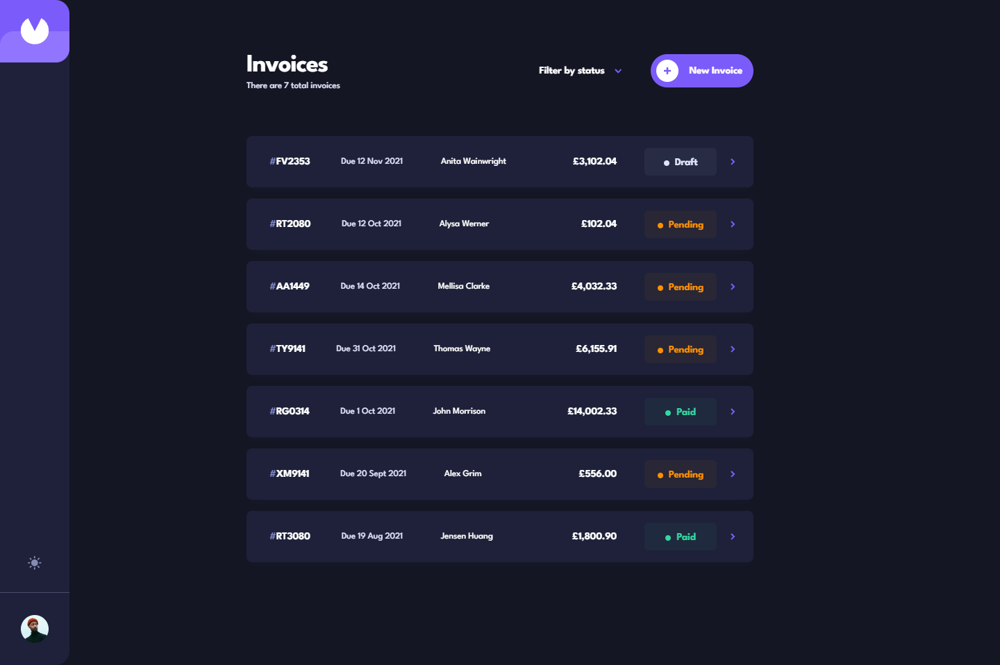

# Invoice App

This repository showcases my solution to the [Invoice app challenge on Frontend Mentor](https://www.frontendmentor.io/challenges/invoice-app-i7KaLTQjl). Frontend Mentor challenges help you improve your coding skills by building realistic projects.

## Table of Contents

- [Overview](#overview)
  - [The Challenge](#the-challenge)
  - [Screenshot](#screenshot)
  - [Links](#links)
- [My Process](#my-process)
  - [Built With](#built-with)
- [Expected Behavior](#expected-behavior)
  - [Creating an Invoice](#creating-an-invoice)
  - [Editing an Invoice](#editing-an-invoice)
  - [Implementation Notes](#implementation-notes)
- [Conclusion](#conclusion)

## Overview

### The Challenge

Users should be able to:

- View the optimal layout for the app depending on their device's screen size
- See hover states for all interactive elements on the page
- Create, read, update, and delete invoices
- Receive form validations when trying to create/edit an invoice
- Save draft invoices, and mark pending invoices as paid
- Filter invoices by status (draft/pending/paid)
- Toggle light and dark mode
- **Bonus**: Keep track of any changes, even after refreshing the browser (`localStorage` could be used for this if you're not building out a full-stack app)

### Screenshot

### Links

- Live Site URL: [Vercel](https://invoice-app-rgomes98.vercel.app/)
- Solution URL: [Frontend Mentor](https://www.frontendmentor.io/solutions/invoice-app-solution-QhxO9UJGvi)

## My Process

### Built With

- [React.js](https://reactjs.org/) - JavaScript library for building user interfaces
- [TypeScript](https://www.typescriptlang.org/) - Typed superset of JavaScript for building large-scale applications
- [Vite](https://vitejs.dev/) - Next generation frontend tooling for building web applications
- [SASS](https://sass-lang.com/) - CSS preprocessor for styling web pages
- [Zod](https://github.com/colinhacks/zod) - Runtime type checking library for TypeScript
- [React Hook Form](https://react-hook-form.com/) - Library for managing forms in React applications
- [Sonner](https://sonner.emilkowal.ski/) - Toast library for displaying non-intrusive messages to users
- [Figma](https://www.figma.com/) - Collaborative design tool used for implementing design files

## Expected Behavior

### Creating an Invoice

- **ID Generation:**

  - Implemented using UUID for uniqueness. Although it doesn't strictly adhere to the format of 2 uppercase letters followed by 4 numbers, it provides randomness and uniqueness.

- **Draft and Pending Status:**
  - Regardless of whether it's saved as a draft or sent, all form fields must be filled in.
  - If saved as a draft, an ID is generated, and the status is set to "draft". If sent, an ID is also generated, and the status is set to "pending".
- **Payment Terms and Total Calculation:**
  - Changing payment terms dynamically updates the payment due date based on the creation date.
  - Total is calculated as the sum of all items on the invoice.

### Editing an Invoice

- **Required Fields and Status Update:**

  - When saving changes, all fields are required. If the user clicks "Cancel", any unsaved changes should be reset.
  - Draft invoices feature an exclusive "Send" button, allowing users to change the status to "pending" instead of automatically updating it.

- **Marking as Paid:**

  - Users can update the status of pending invoices to "paid" when marking them as such.

- **Confirmation Modal for Deletion:**
  - Users receive a confirmation modal before deleting invoices.

### Implementation Notes

- **Styling:**
  - Custom styling for date input and select fields was intentionally omitted due to limitations in applying custom CSS. The appearance of these elements is controlled by the user's browser or operating system, making it challenging to achieve consistent and advanced customization solely with plain CSS.

## Conclusion

This Invoice Management System provides a robust solution for managing invoices, allowing for easy creation, editing, and tracking of invoice statuses. It's designed to be intuitive and user-friendly while meeting the requirements outlined.
